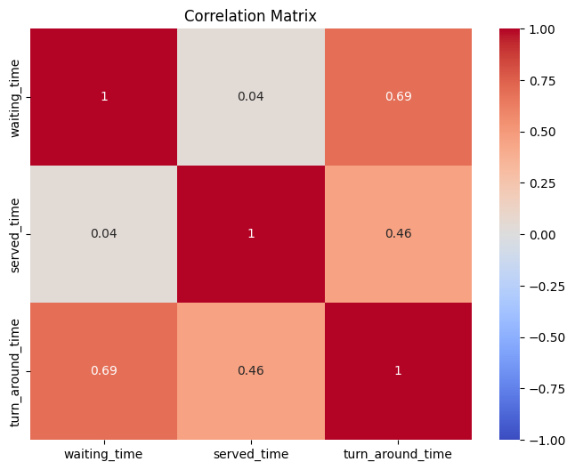

# Submitted By: Anish Manandhar
1. Sample Data -> Restore (10 Marks) 


Deleting unnecessary tables:
```
DROP TABLE demo;
DROP TABLE jobs;
```

2.  Tables Definition and Their Relation 
Table: calls

Primary Key :
call_statuses

Primary Key : id

Table: counters:

primary key: id

Table: demo

Primary key:id

Table: jobs


Table: language

Primary Key : id

Table: permissions

Primary Key : id

Table: queues

Primary Key : id

Table:roles

Primary Key : id

Table: role_has_permissions

Primary Key : permission_id,role_id

Table: services

Primary Key : id

Table:sqlite_sequences

Primary Key : id
Table:users


Calls fk

queue


role_has_permissions

Relationship: calls table has a list of foreign keys that refer to the other respective tables
```
PRAGMA table_info(calls);
PRAGMA table_info(call_statuses);
PRAGMA table_info(counters);
PRAGMA table_info(demo);
PRAGMA table_info(jobs);
PRAGMA table_info(languages);
PRAGMA table_info(permissions);
PRAGMA table_info(queues);
PRAGMA table_info(roles);
PRAGMA table_info(role_has_permissions);
PRAGMA table_info(services);
PRAGMA table_info(sqlite_sequence);
PRAGMA table_info(users);

PRAGMA foreign_key_list(calls);
PRAGMA foreign_key_list(call_statuses);
PRAGMA foreign_key_list(counters);
PRAGMA foreign_key_list(demo);
PRAGMA foreign_key_list(jobs);
PRAGMA foreign_key_list(languages);
PRAGMA foreign_key_list(permissions);
PRAGMA foreign_key_list(queues);
PRAGMA foreign_key_list(roles);
PRAGMA foreign_key_list(role_has_permissions);
PRAGMA foreign_key_list(services);
PRAGMA foreign_key_list(sqlite_sequence);
PRAGMA foreign_key_list(users);
```
*Summary*
- *calls* refer to
	- *users* with the help of a foreign key **user_id**
	- *services* with the help of a foreign key **service_id**
	- *queues* with the help of a foreign key **queue_id**.
	- *counters* with the help of a foreign key **counter_id**
	- *call_statuses* with the help of a foreign key **call_status_id**
	
- *queues* referes to 
	- *services* with the fk **service_id**
- *role_has_permission* referes to
	-*roles* with the fk **role_id**
	-*permission* with the fk **permission_id**

3. Counter Summary (10 Marks) 
○  Task:  Write an SQL query to get a summary of counters  for any given date, 
including the total queue called, serving, served, and no-show. 
○  Note:  Use data from "2024-02-14" for the output. 
○  Submission:  Provide the SQL query and the output as  an image or screenshot.


```
SELECT 
    counter_id,
    COUNT(*) AS called,
    SUM(served_time) AS serving,
    SUM(waiting_time) AS served,  
    SUM(CASE WHEN call_status_id = 2 THEN 1 ELSE 0 END) AS noshow

 FROM 
    calls
 WHERE 
    DATE(created_at) = '2024-02-14'
 GROUP BY 
    counter_id;
```

4. Service Summary

```

SELECT 
    c.service_id,
    s.letter,
    COUNT(*) AS visitor,
	SUM(c.served_time) AS queued,
    COUNT(*) AS called,
    SUM(CASE WHEN c.call_status_id = 1 THEN 1 ELSE 0 END) AS served,

    SUM(c.served_time) AS serving,
    SUM(CASE WHEN c.call_status_id = 2 THEN 1 ELSE 0 END) AS noshow,
    SUM(c.turn_around_time) AS total_turn_around_time
FROM 
    calls c
INNER JOIN 
    services s ON c.service_id = s.id
WHERE 
    DATE(c.created_at) = '2024-02-14'
GROUP BY 
    c.service_id;
```

5. Service X Counter Summary
``` sql
 	SELECT 
	c.service_id,
    s.letter,
    c.counter_id,
	COUNT(*) AS visitor,

    
    SUM(c.served_time) AS total_served_time,
    SUM(c.waiting_time) AS Waiting,
    SUM(c.served_time) AS serving,
    SUM(CASE WHEN c.call_status_id = 1 THEN 1 ELSE 0 END) AS served,
   SUM(CASE WHEN c.call_status_id = 2 THEN 1 ELSE 0 END) AS noshow

FROM 
    calls c
INNER JOIN 
    services s ON c.service_id = s.id
WHERE 
    DATE(c.created_at) = '2024-02-14'
GROUP BY 
    c.counter_id, c.service_id, s.letter
ORDER BY 
    c.service_id;
```

 6. Agent summary
 
 ```sql
 SELECT 
    c.service_id,
    s.letter,
    c.counter_id,
    COUNT(*) AS visitor,
    SUM(c.served_time) AS total_served_time,
    SUM(c.waiting_time) AS Waiting,
    SUM(c.served_time) AS serving,
    SUM(CASE WHEN c.call_status_id = 1 THEN 1 ELSE 0 END) AS served,
    SUM(CASE WHEN c.call_status_id = 2 THEN 1 ELSE 0 END) AS noshow,
    u.id AS user_id,       -- Include user_id for more details
    u.name AS user_name    -- Include user name for more details
FROM 
    calls c
INNER JOIN 
    services s ON c.service_id = s.id
INNER JOIN 
    users u ON c.user_id = u.id
WHERE 
    DATE(c.created_at) = '2024-02-14'
GROUP BY 
    c.counter_id, c.service_id, s.letter, u.id, u.name
ORDER BY 
    c.service_id;
```

7.  Service Efficiency Analysis



Dataset Summary:
ID and Service ID:

id and service_id columns have their count, mean, std (standard deviation), min, 25th percentile (Q1), median (Q2), 75th percentile (Q3), and max values listed. These are identifiers and don't directly impact the correlation insights but help understand the dataset's structure.
Waiting Time, Served Time, Turn Around Time:

Waiting Time:

Mean: ~1 hour 10 minutes
Std (Standard Deviation): ~49 minutes
Min: 0 (indicating some cases with no waiting time)
25% (Q1): ~29 minutes
Median (Q2): ~1 hour 2 minutes
75% (Q3): ~1 hour 40 minutes
Max: ~4 hours 55 minutes
Served Time:

Mean: ~10 minutes
Std (Standard Deviation): ~11 minutes
Min: 0 (indicating some cases with no served time)
25% (Q1): ~2 minutes
Median (Q2): ~9 minutes
75% (Q3): ~14 minutes
Max: ~3 hours 4 minutes
Turn Around Time:

Mean: ~1 hour 6 minutes
Std (Standard Deviation): ~55 minutes
Min: 0 (indicating some cases with no turn around time)
25% (Q1): ~20 minutes
Median (Q2): ~56 minutes
75% (Q3): ~1 hour 42 minutes
Max: ~5 hours 18 minutes
Correlation Interpretations with Statistical Context:
Waiting Time and Served Time (0.04):

Very weak correlation: The minimal correlation (0.04) indicates that the variability in waiting time does not explain the variability in served time. This is consistent with the observed large standard deviations and the spread from min to max values, showing that served time varies independently of waiting time.
Waiting Time and Turn Around Time (0.69):

Moderate to strong correlation: The correlation of 0.69 suggests a strong relationship between waiting time and turn around time. Given that turn around time is the sum of waiting and served times, it makes sense that a longer waiting time would contribute significantly to a longer turn around time. The statistics show a wide range for both waiting time and turn around time, supporting the observed correlation.
Served Time and Turn Around Time (0.46):

Moderate correlation: The 0.46 correlation coefficient indicates a moderate positive relationship between served time and turn around time. This makes sense because served time is part of the turn around time, although it appears that waiting time has a more substantial impact on the overall turn around time given the stronger correlation.
Additional Insights:
Waiting Time has the highest standard deviation among the three, indicating significant variability, which aligns with its strong correlation with turn around time.
Served Time shows considerable variability but is generally much shorter on average compared to waiting and turn around times, which influences its lower correlation with waiting time and moderate correlation with turn around time.
The wide range from min to max values across all three variables highlights the diversity in the dataset, contributing to the observed correlations.These statistical insights provide a clearer understanding of the relationships and dependencies between waiting time, served time, and turn around time in your dataset.